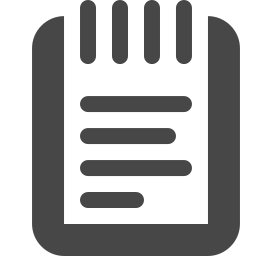
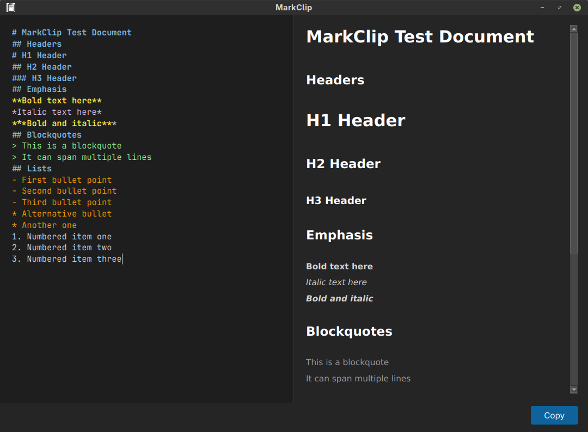

# MarkClip

A Markdown editor that gets out of your way and lets you write, preview, and
copy beautiful content to Word, Google Docs, or any email client without
fuss.

MarkClip gives you a split-pane editing experience with live preview on the
right and a debounced renderer that keeps up with your typing speed. When
you're ready to share, hit the Copy button and paste your styled content
directly into your document or email.

## Features

- Split-pane editor with live Markdown preview
- One-click copy as styled HTML - paste straight into Word, Docs, or email
- Dark theme that's easy on the eyes during long writing sessions
- Full Markdown support including tables and strikethrough
- Resizable panes so you can focus on the editor or preview as needed

## Screenshot



## Installation

Requires Python 3.10 or later.

```bash
pip install PyQt6 mistune
```

Or if you use uv:

```bash
uv sync
```

## Usage

```bash
python main.py
```

Or run the launcher script:

```bash
./mark-clip.sh
```

Write your Markdown in the left pane. Your rendered preview appears instantly
on the right. When you're done, click Copy and paste into your document.

## Tech Stack

- Python 3
- PyQt6
- mistune

## License

MIT License
